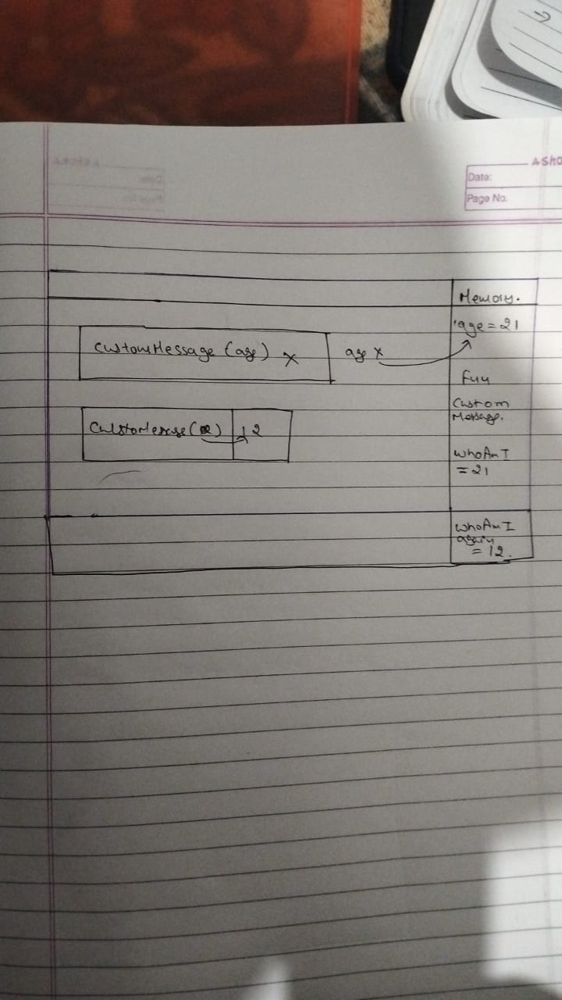

1. What does thread of execution means in JavaScript?
   Javascript runs code line by line. This mean whenever we run a code the JS engine will run the code line by line .JS is a synchronous language which means that it will run the line of a code only if the previous line is completed.
2. Where the JavaScript code gets executed?
   The JS code run inside the js engine.
3. What does context means in Global Execution Context?
   Context basically means where we run our code.Basically in global context whenever we run code a global context is created where all the execution occurs.If functional execution context need to be creeatd it will be created inside this global context.
4. When do you create a global execution context.
   Whenever we write a program and once we run it ,the global execution will be created.
5. Execution context consists of what all things?
   Whether it is a global or functional context it ceates memory section where it stores memory and contains execution context where all the execution happens.
6. What are the different types of execution context?
   There are two types of execution context 1.Global execution context 2.FFunction execution context.
7. When global and function execution context gets created?
   Whenevr we run our program global execution context is created . Whenever we call or execute a function,functional execution context will be created.
8. Function execution gets created during function execution or while declaring a function.
   It gets created during

9. Create a execution context diagram of the following code on your notebook. Take a screenshot/photo and store it in the folder named `img`. Use `` to display it here.

```js
var user = "Arya";

function sayHello() {
  return `Hello ${user}`;
}

var userMsg = sayHello(user);
```

<!-- Put your image here -->


```js
var marks = 400;
var total = 500;

function getPercentage(amount, totalAmount) {
  return (amount * 100) / totalAmount;
}

var percentageMarks = getPercentage(marks, total);
var percentageProfit = getPercentage(400, 200);
```

<!-- Put your image here -->


```js
var age = 21;

function customeMessage(userAge) {
  if (userAge > 18) {
    return `You are an adult`;
  } else {
    return `You are a kid`;
  }
}

var whoAmI = customeMessage(age);
var whoAmIAgain = customeMessage(12);
```

<!-- Put your image here -->


